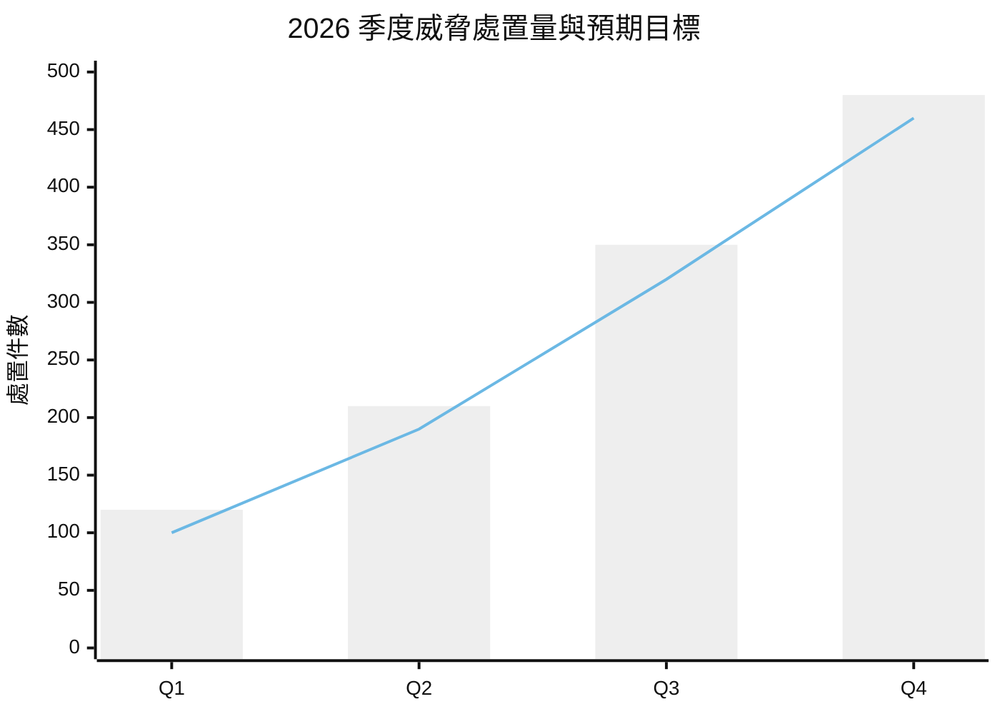
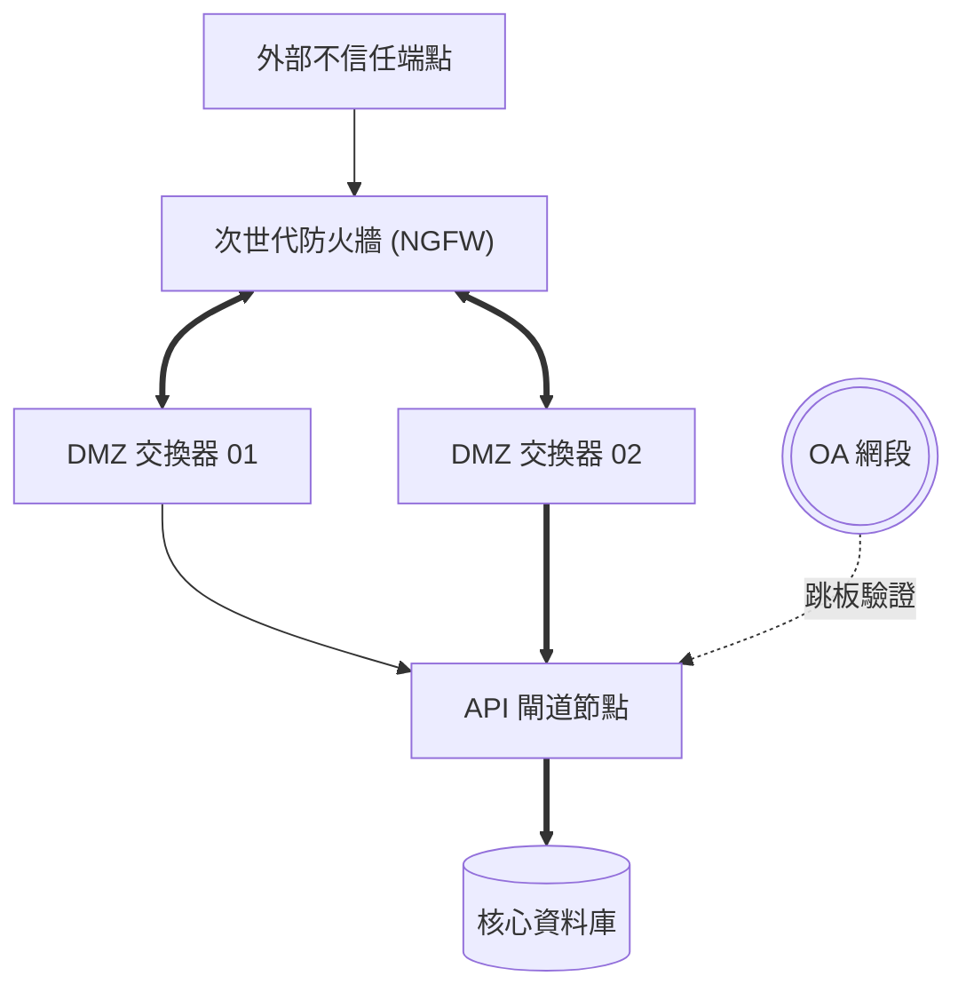
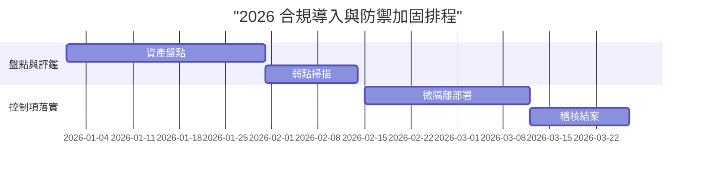
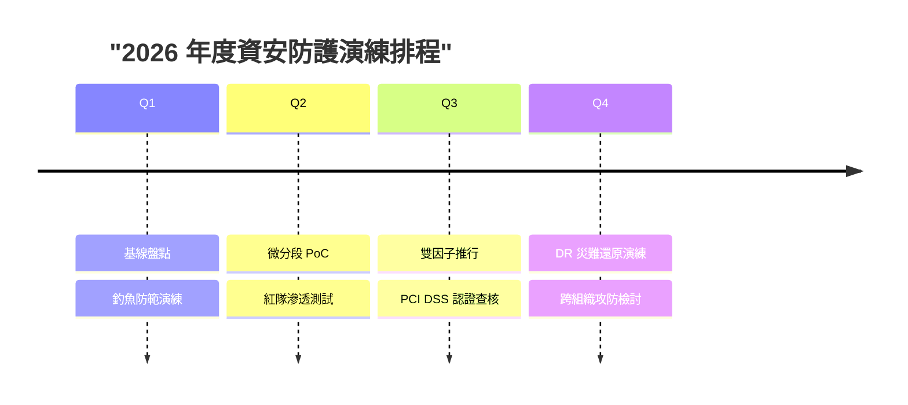

# Markdown Visual Preview Specification (`md_preview.md`)

Fast, browser-ready preview protocol using modern Web CSS design tokens and native Mermaid diagrams. Designed for immediate inspection in HackMD or any browser Markdown previewer before compiling to formal PDF.

---

## 1. Embedded Design Tokens & Surface Styles

Place this `<style>` block at the top of the generated Markdown preview file. It automatically adapts to Light Mode, Dark Mode, and HackMD with zero `!important` reliance.

```html
<style>
:root {
  --surface-base: #f8fafc;
  --surface-card: #ffffff;
  --border-subtle: #e2e8f0;
  --text-main: #0f172a;
  --text-muted: #64748b;
  --brand-primary: #1e3a8a;
  --brand-accent: #2563eb;
  --kpi-bg: #f1f5f9;
  --radius-sm: 6px;
  --radius-md: 10px;
}
@media (prefers-color-scheme: dark) {
  :root {
    --surface-base: #0b1120;
    --surface-card: #1e293b;
    --border-subtle: #334155;
    --text-main: #f8fafc;
    --text-muted: #94a3b8;
    --brand-primary: #38bdf8;
    --brand-accent: #60a5fa;
    --kpi-bg: #0f172a;
  }
}
body.ui-dark, body.theme-dark, [data-theme="dark"] {
  --surface-base: #0b1120;
  --surface-card: #1e293b;
  --border-subtle: #334155;
  --text-main: #f8fafc;
  --text-muted: #94a3b8;
  --brand-primary: #38bdf8;
  --brand-accent: #60a5fa;
  --kpi-bg: #0f172a;
}
.doc-header { margin-bottom: 1.5rem; border-bottom: 2px solid var(--border-subtle); padding-bottom: 0.8rem; }
.doc-header h1 { margin: 0 0 0.3rem 0; color: var(--brand-primary); font-size: 1.85rem; }
.doc-header .doc-subtitle { color: var(--text-muted); font-size: 0.95rem; margin: 0; }
.doc-section-title { display: flex; align-items: center; gap: 8px; margin: 2rem 0 1rem 0; padding-left: 10px; border-left: 4px solid var(--brand-accent); color: var(--brand-primary); font-size: 1.25rem; font-weight: 700; }
.kpi-grid { display: grid; grid-template-columns: repeat(auto-fit, minmax(130px, 1fr)); gap: 12px; margin: 1.2rem 0 1.8rem 0; }
.kpi-card { background: var(--kpi-bg); border: 1px solid var(--border-subtle); border-radius: var(--radius-sm); padding: 0.85rem 0.6rem; text-align: center; }
.kpi-val { font-size: 1.45rem; font-weight: 800; color: var(--brand-primary); line-height: 1.2; }
.kpi-label { font-size: 0.8rem; color: var(--text-muted); margin-top: 4px; }
.card-grid { display: grid; grid-template-columns: repeat(auto-fit, minmax(300px, 1fr)); gap: 16px; margin-bottom: 1.8rem; }
.card { background: var(--surface-card); border: 1px solid var(--border-subtle); border-radius: var(--radius-md); padding: 1.2rem 1.4rem; box-shadow: 0 1px 3px rgba(0, 0, 0, 0.05); }
.card.col-span-2 { grid-column: 1 / -1; }
.card h4 { margin-top: 0; color: var(--brand-primary); font-size: 1.05rem; }
.card p, .card li { color: var(--text-main); line-height: 1.6; }
.chart-card { background: var(--surface-card); border: 1px solid var(--border-subtle); border-radius: var(--radius-md); padding: 1rem; overflow-x: auto; margin-bottom: 1.2rem; }
</style>
```

---

## 2. Standard Component Templates

### Template A: Document Header & KPI Grid
```html
<div class="doc-header">
  <h1>2026 資安防護戰略與營運指標看板</h1>
  <p class="doc-subtitle">全面落實 CIS 基線加固 · 零信任微分段架構 · 自動化威脅處置</p>
</div>
<div class="kpi-grid">
  <div class="kpi-card"><div class="kpi-val">99.98%</div><div class="kpi-label">服務可用率</div></div>
  <div class="kpi-card"><div class="kpi-val">&lt; 15ms</div><div class="kpi-label">閘道防護延遲</div></div>
  <div class="kpi-card"><div class="kpi-val">17 單位</div><div class="kpi-label">ISMS 合規輔導</div></div>
  <div class="kpi-card"><div class="kpi-val">0 件</div><div class="kpi-label">P0 漏報事故</div></div>
</div>
```

### Template B: Split Cards (As-Is / To-Be)
```html
<h3 class="doc-section-title">現況挑戰與處置行動</h3>
<div class="card-grid">
  <div class="card">
    <h4>✖ 當前痛點與瓶頸</h4>
    <ul><li>審查週期長達 3.5 天，跨系統查驗延宕。</li><li>特權帳號盤點依賴試算表，缺乏即時追蹤。</li></ul>
  </div>
  <div class="card">
    <h4>✔ 處置行動與自動化</h4>
    <ul><li>導入自動化規則比對，處置時間降至 15 分鐘。</li><li>集中式 IAM 稽核鏈，每日自動核對權限異動。</li></ul>
  </div>
</div>
```

### Template C: Native Mermaid Charts

#### 1. Mixed Chart: Bar + Line (`xychart-beta`)
````markdown
<div class="chart-card">

</div>
````

#### 2. Network Topology & Defense Flow (`flowchart TD`)
````markdown
<div class="chart-card">

</div>
````

#### 3. Gantt Project Schedule (`gantt`)
````markdown
<div class="chart-card">

</div>
````

#### 4. Milestone Timeline (`timeline`)
````markdown
<div class="chart-card">

</div>
````

#### 5. Compliance Requirement Traceability (`requirementDiagram`)
````markdown
<div class="chart-card">
```mermaid
requirementDiagram
    requirement isms_p0 {
      id: ISO-27001-A.9
      text: 特權存取必須啟用雙因子與即時稽核
      risk: High
      verifymethod: Test
    }
    element iam_gateway {
      type: Module
    }
    iam_gateway - satisfies -> isms_p0
```
</div>
````

---

## 3. Workflow: Preview First -> PDF Publish

1. **Phase 1 (Preview)**: Directly generate `preview.md` containing the `<style>` block and Markdown/Mermaid components. Inspect in browser/HackMD.
2. **Phase 2 (Refine)**: Adjust narrative, numbers, and layout directly in plain Markdown.
3. **Phase 3 (PDF Publish)**: When confirmed, invoke `scripts/builder.py` following `references/pdf_generate.md` to compile the final print-ready A4 PDF.
