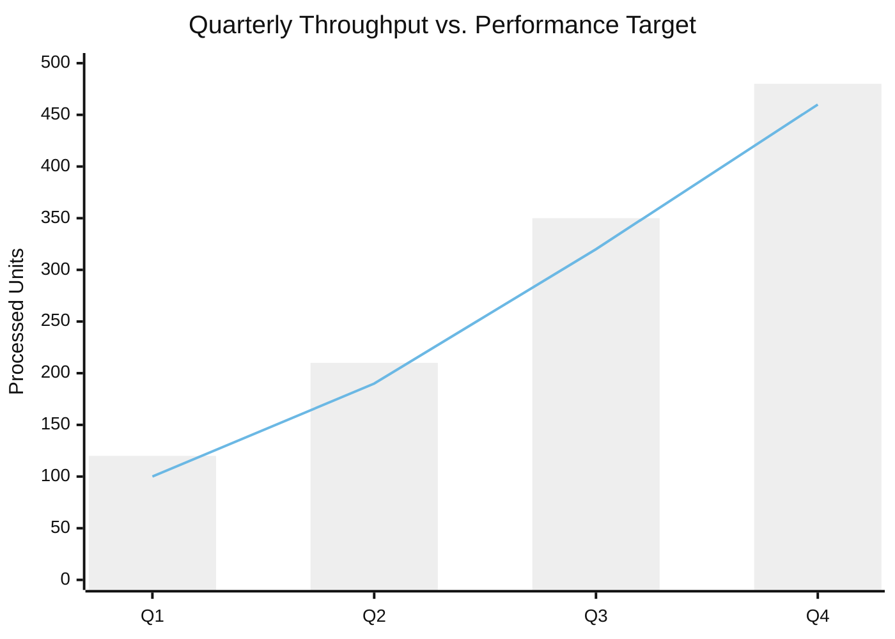
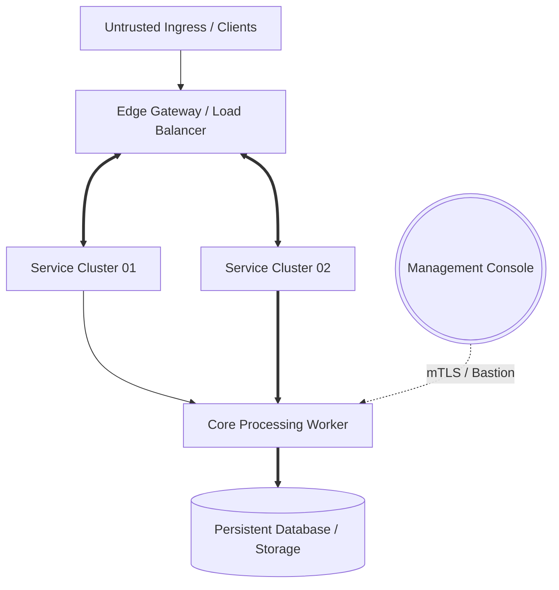
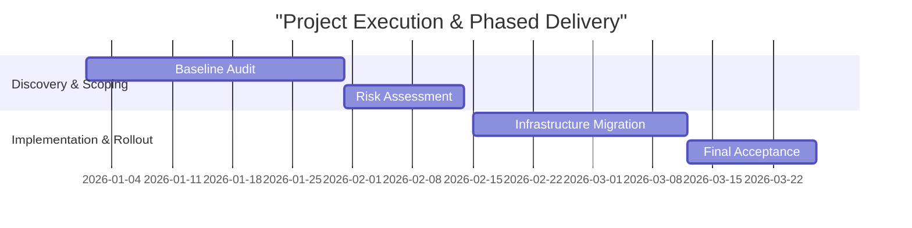
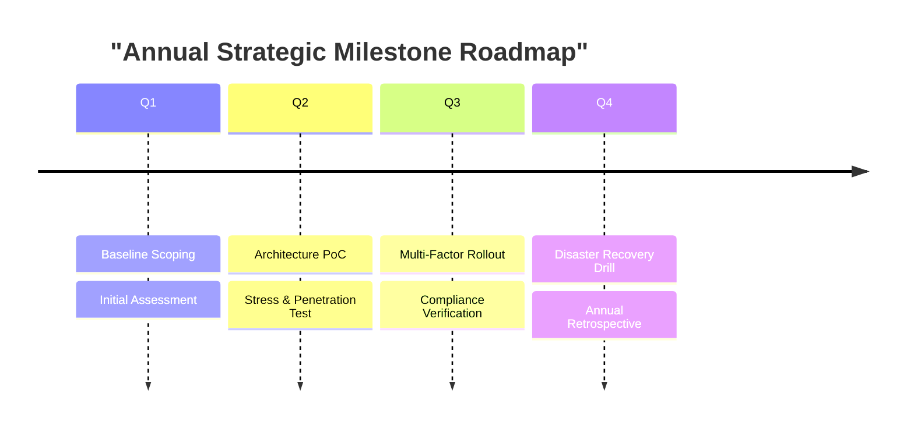

# Markdown Visual Preview Specification (`md_preview.md`)

Fast, browser-ready preview protocol using modern Web CSS design tokens and native Mermaid diagrams. Designed for immediate inspection in HackMD or any browser Markdown previewer before compiling to formal PDF.

---

## 1. Embedded Design Tokens & Surface Styles

Place this canonical style block at the top of every generated Markdown preview file to ensure automatic Light Mode, Dark Mode, and HackMD adaptability:

```html
<style>
:root {
  --surface-base: #FFFFFF;
  --surface-card: #F8FAFC;
  --border-subtle: #CBD5E1;
  --text-main: #0B0F19;
  --text-muted: #64748B;
  --brand-primary: #2B5C8F;
  --brand-accent: #007A92;
  --kpi-bg: #F1F5F9;
  --radius-sm: 6px;
  --radius-md: 10px;
}
@media (prefers-color-scheme: dark) {
  :root {
    --surface-base: #0B1120;
    --surface-card: #1E293B;
    --border-subtle: #334155;
    --text-main: #F8FAFC;
    --text-muted: #94A3B8;
    --brand-primary: #38BDF8;
    --brand-accent: #60A5FA;
    --kpi-bg: #0F172A;
  }
}
body.ui-dark, body.theme-dark, [data-theme="dark"] {
  --surface-base: #0B1120;
  --surface-card: #1E293B;
  --border-subtle: #334155;
  --text-main: #F8FAFC;
  --text-muted: #94A3B8;
  --brand-primary: #38BDF8;
  --brand-accent: #60A5FA;
  --kpi-bg: #0F172A;
}
.doc-header { margin-bottom: 1.5rem; border-bottom: 2px solid var(--border-subtle); padding-bottom: 0.8rem; }
.doc-header h1 { margin: 0 0 0.3rem 0; color: var(--brand-primary); font-size: 1.85rem; }
.doc-header .doc-subtitle { color: var(--text-muted); font-size: 0.95rem; margin: 0; }
.doc-section-title { display: flex; align-items: center; gap: 8px; margin: 2rem 0 1rem 0; padding-left: 10px; border-left: 4px solid var(--brand-accent); color: var(--brand-primary); font-size: 1.25rem; font-weight: 700; }
.kpi-grid { display: grid; grid-template-columns: repeat(auto-fit, minmax(130px, 1fr)); gap: 12px; margin: 1.2rem 0 1.8rem 0; }
.kpi-card { background: var(--kpi-bg); border: 1px solid var(--border-subtle); border-radius: var(--radius-sm); padding: 0.85rem 0.6rem; text-align: center; }
.kpi-val { font-size: 1.45rem; font-weight: 800; color: var(--brand-primary); line-height: 1.2; }
.kpi-label { font-size: 0.8rem; color: var(--text-muted); margin-top: 4px; }
.card-grid { display: grid; grid-template-columns: repeat(auto-fit, minmax(300px, 1fr)); gap: 16px; margin-bottom: 1.8rem; }
.card { background: var(--surface-card); border: 1px solid var(--border-subtle); border-radius: var(--radius-md); padding: 1.2rem 1.4rem; box-shadow: 0 1px 3px rgba(0, 0, 0, 0.05); }
.card.col-span-2 { grid-column: 1 / -1; }
.card h4 { margin-top: 0; color: var(--brand-primary); font-size: 1.05rem; }
.card p, .card li { color: var(--text-main); line-height: 1.6; }
.chart-card { background: var(--surface-card); border: 1px solid var(--border-subtle); border-radius: var(--radius-md); padding: 1rem; overflow-x: auto; margin-bottom: 1.2rem; }
</style>
```

Core UI tokens:
- **Colors**: `--brand-primary` (`#2B5C8F`), `--brand-accent` (`#007A92`), `--surface-card` (`#F8FAFC`), `--border-subtle` (`#CBD5E1`)
- **Containers**: `.doc-header` (Header), `.kpi-grid` / `.kpi-card` (KPIs), `.card-grid` / `.card` (Bento layout), `.chart-card` (Mermaid container)

---

## 2. Standard Component Templates

### Template A: Document Header & KPI Grid
```html
<div class="doc-header">
  <h1>Executive Strategy & Performance Dashboard</h1>
  <p class="doc-subtitle">Operational Baseline · Continuous Verification · Automated Workflow</p>
</div>
<div class="kpi-grid">
  <div class="kpi-card"><div class="kpi-val">99.98%</div><div class="kpi-label">Service Availability</div></div>
  <div class="kpi-card"><div class="kpi-val">&lt; 15ms</div><div class="kpi-label">Average Latency</div></div>
  <div class="kpi-card"><div class="kpi-val">12 Units</div><div class="kpi-label">Active Modules</div></div>
  <div class="kpi-card"><div class="kpi-val">0</div><div class="kpi-label">Critical Incidents</div></div>
</div>
```

### Template B: Split Cards (As-Is vs. To-Be / Contrast)
```html
<h3 class="doc-section-title">Operational Challenges & Mitigation Plan</h3>
<div class="card-grid">
  <div class="card">
    <h4>✖ As-Is (Bottlenecks & Gaps)</h4>
    <ul><li>Manual review cycle averages 3.5 days, delaying deployment.</li><li>Asset inventory relies on spreadsheets without live drift tracking.</li></ul>
  </div>
  <div class="card">
    <h4>✔ To-Be (Target Architecture)</h4>
    <ul><li>Automated policy engine reduces verification turnaround to &lt; 15 minutes.</li><li>Continuous IAM auditing pipeline detects unauthorized config drift daily.</li></ul>
  </div>
</div>
```

### Template C: Native Mermaid Visual Archetypes

#### 1. Dual-Track Chart: Volume vs. Target (`xychart-beta`)
````markdown
<div class="chart-card">



</div>
````

#### 2. Architecture Topology & Flow (`flowchart TD`)
````markdown
<div class="chart-card">



</div>
````

#### 3. Phased Roadmap & Dependency Schedule (`gantt`)
````markdown
<div class="chart-card">



</div>
````

#### 4. Milestone Timeline (`timeline`)
````markdown
<div class="chart-card">



</div>
````

#### 5. Specification & Requirement Traceability (`requirementDiagram`)
````markdown
<div class="chart-card">

```mermaid
requirementDiagram
    requirement req_p0 {
      id: REQ-001-CORE
      text: Critical access must enforce dual-factor auth and automated audit logging
      risk: High
      verifymethod: Test
    }
    element auth_gateway {
      type: Component
    }
    auth_gateway - satisfies -> req_p0
```

</div>
````

---

## 3. Workflow: Preview First -> PDF Publish

1. **Phase 1 (Preview)**: Prepend the CSS style block at document head and assemble Markdown/Mermaid components. Inspect in browser/HackMD.
2. **Phase 2 (Refine)**: Adjust narrative, numbers, and layout directly in plain Markdown. Run `scripts/verifier.py preview.md`.
3. **Phase 3 (PDF Publish)**: When confirmed, invoke `scripts/builder.py` following `references/pdf_generate.md` to compile the final print-ready A4 PDF.
