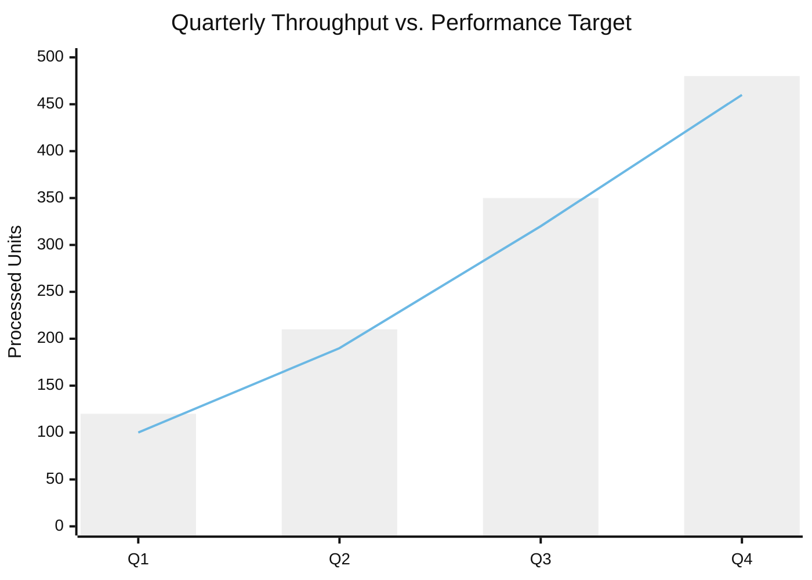
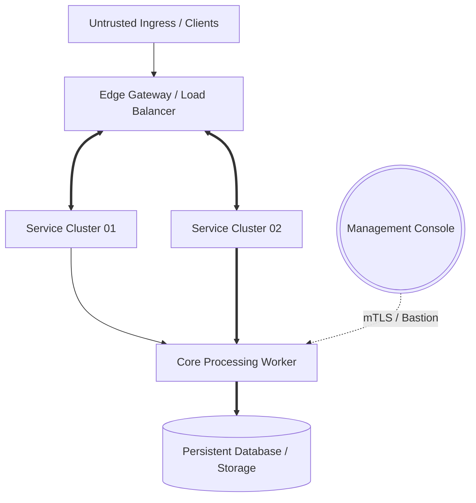
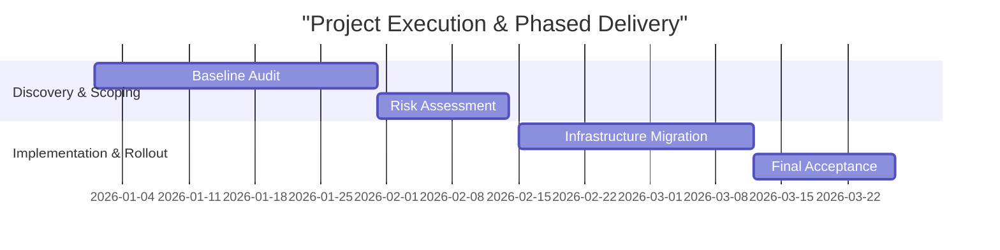
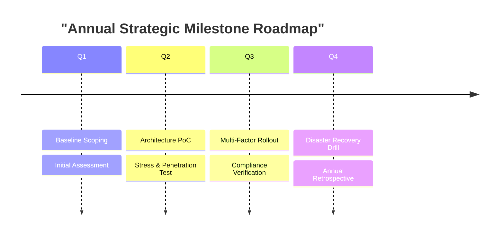

# Markdown Visual Preview Specification (`md_preview.md`)

Fast, browser-ready preview protocol using modern Web CSS design tokens and native Mermaid diagrams. Designed for immediate inspection in HackMD or any browser Markdown previewer before compiling to formal PDF.

---

## 1. Embedded Design Tokens & Surface Styles

The canonical `<style>` block is managed centrally in [`scripts/preview.css`](../scripts/preview.css).
Insert this style block at the top of every preview Markdown file to ensure automatic Light Mode, Dark Mode, and HackMD adaptability:

```html
<!-- Canonical style block from scripts/preview.css -->
<style>
/* Load contents of scripts/preview.css */
</style>
```

Core UI tokens defined in [`scripts/preview.css`](../scripts/preview.css):
- **Colors**: `--brand-primary` (`#2B5C8F`), `--brand-accent` (`#007A92`), `--surface-card` (`#F8FAFC`), `--border-subtle` (`#CBD5E1`)
- **Containers**: `.doc-header` (Header), `.kpi-grid` / `.kpi-card` (KPIs), `.card-grid` / `.card` (Bento layout), `.chart-card` (Mermaid container)

---

## 2. Standard Component Templates (`templates/`)

Modular component skeletons are stored under the [`templates/`](../templates/) directory for plug-and-play report construction:

### Template A: Document Header & KPI Grid ([`templates/template_a_header_kpi.html`](../templates/template_a_header_kpi.html))
```html
<div class="doc-header">
  <h1>Executive Strategy & Performance Dashboard</h1>
  <p class="doc-subtitle">Operational Baseline · Continuous Verification · Automated Workflow</p>
</div>
<div class="kpi-grid">
  <div class="kpi-card"><div class="kpi-val">99.98%</div><div class="kpi-label">Service Availability</div></div>
  <div class="kpi-card"><div class="kpi-val">&lt; 15ms</div><div class="kpi-label">Average Latency</div></div>
  <div class="kpi-card"><div class="kpi-val">12 Units</div><div class="kpi-label">Active Modules</div></div>
  <div class="kpi-card"><div class="kpi-val">0</div><div class="kpi-label">Critical Incidents</div></div>
</div>
```

### Template B: Split Cards (As-Is vs. To-Be / Contrast) ([`templates/template_b_split_cards.html`](../templates/template_b_split_cards.html))
```html
<h3 class="doc-section-title">Operational Challenges & Mitigation Plan</h3>
<div class="card-grid">
  <div class="card">
    <h4>✖ As-Is (Bottlenecks & Gaps)</h4>
    <ul><li>Manual review cycle averages 3.5 days, delaying deployment.</li><li>Asset inventory relies on spreadsheets without live drift tracking.</li></ul>
  </div>
  <div class="card">
    <h4>✔ To-Be (Target Architecture)</h4>
    <ul><li>Automated policy engine reduces verification turnaround to &lt; 15 minutes.</li><li>Continuous IAM auditing pipeline detects unauthorized config drift daily.</li></ul>
  </div>
</div>
```

### Template C: Native Mermaid Visual Archetypes ([`templates/template_c_charts.md`](../templates/template_c_charts.md))

#### 1. Dual-Track Chart: Volume vs. Target (`xychart-beta`)
````markdown
<div class="chart-card">

</div>
````

#### 2. Architecture Topology & Flow (`flowchart TD`)
````markdown
<div class="chart-card">

</div>
````

#### 3. Phased Roadmap & Dependency Schedule (`gantt`)
````markdown
<div class="chart-card">

</div>
````

#### 4. Milestone Timeline (`timeline`)
````markdown
<div class="chart-card">

</div>
````

#### 5. Specification & Requirement Traceability (`requirementDiagram`)
````markdown
<div class="chart-card">
```mermaid
requirementDiagram
    requirement req_p0 {
      id: REQ-001-CORE
      text: Critical access must enforce dual-factor auth and automated audit logging
      risk: High
      verifymethod: Test
    }
    element auth_gateway {
      type: Component
    }
    auth_gateway - satisfies -> req_p0
```
</div>
````

---

## 3. Workflow: Preview First -> PDF Publish

1. **Phase 1 (Preview)**: Fetch `<style>` from [`scripts/preview.css`](../scripts/preview.css) and assemble Markdown/Mermaid components from [`templates/`](../templates/). Inspect in browser/HackMD.
2. **Phase 2 (Refine)**: Adjust narrative, numbers, and layout directly in plain Markdown. Run `scripts/verifier.py preview.md`.
3. **Phase 3 (PDF Publish)**: When confirmed, invoke `scripts/builder.py` following `references/pdf_generate.md` to compile the final print-ready A4 PDF.
