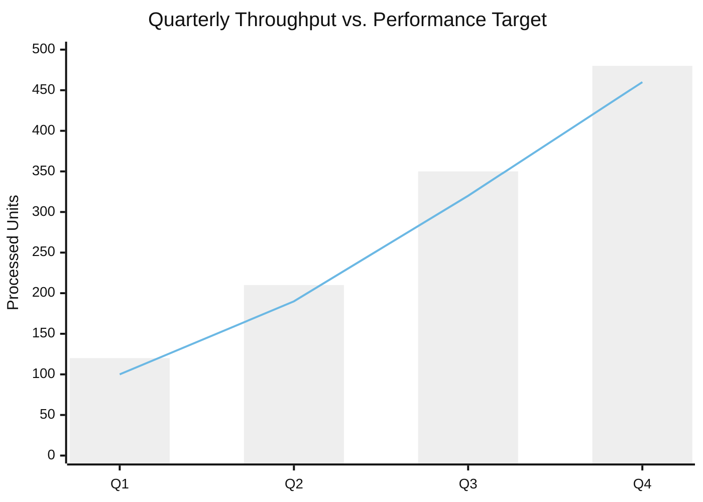
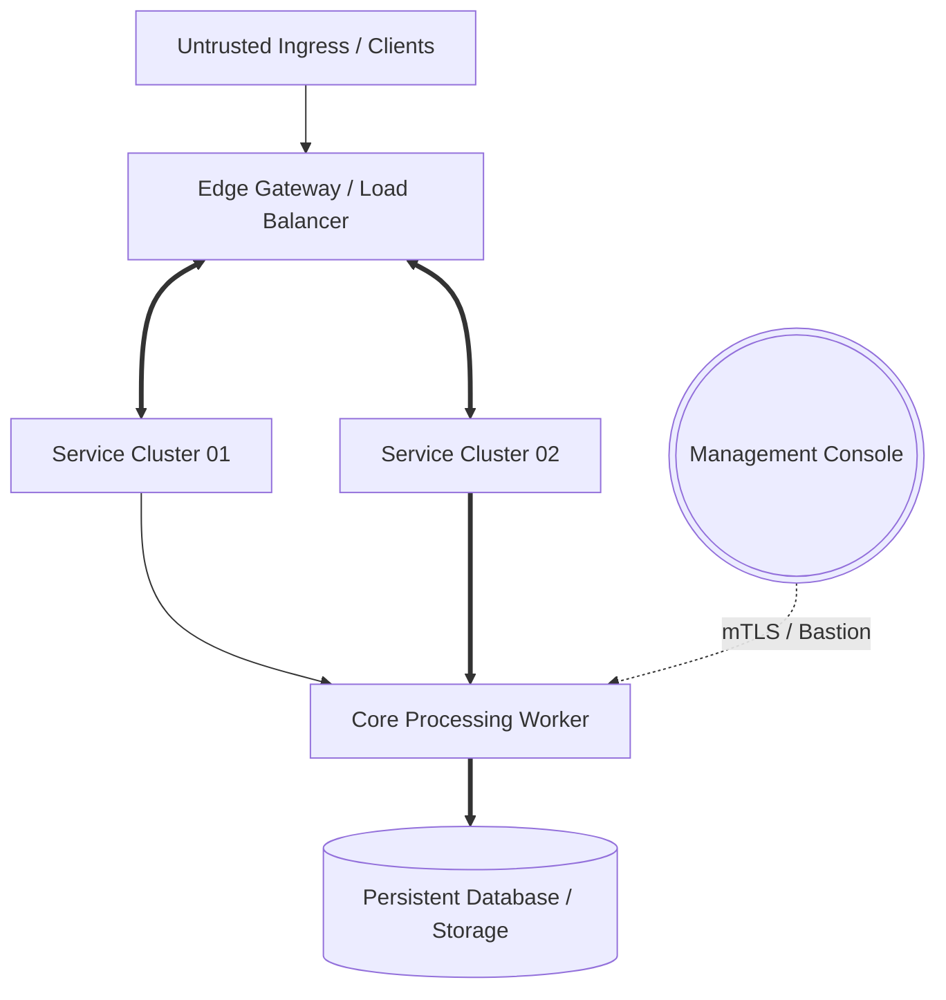
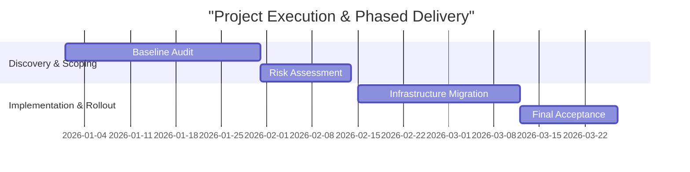
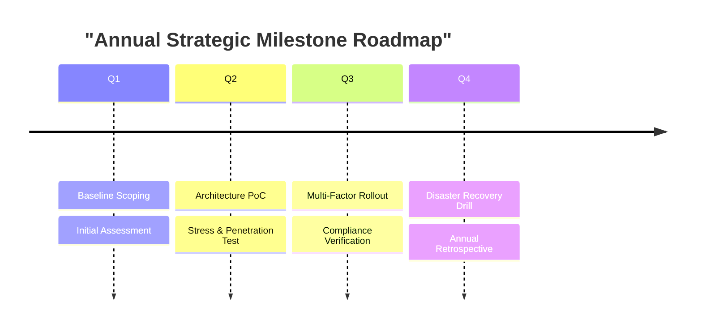

<!-- Template C: Native Mermaid Visual Archetypes -->

#### 1. Dual-Track Chart: Volume vs. Target (`xychart-beta`)
<div class="chart-card">



</div>

#### 2. Architecture Topology & Flow (`flowchart TD`)
<div class="chart-card">



</div>

#### 3. Phased Roadmap & Dependency Schedule (`gantt`)
<div class="chart-card">



</div>

#### 4. Milestone Timeline (`timeline`)
<div class="chart-card">



</div>

#### 5. Specification & Requirement Traceability (`requirementDiagram`)
<div class="chart-card">

```mermaid
requirementDiagram
    requirement req_p0 {
      id: REQ-001-CORE
      text: Critical access must enforce dual-factor auth and automated audit logging
      risk: High
      verifymethod: Test
    }
    element auth_gateway {
      type: Component
    }
    auth_gateway - satisfies -> req_p0
```

</div>
