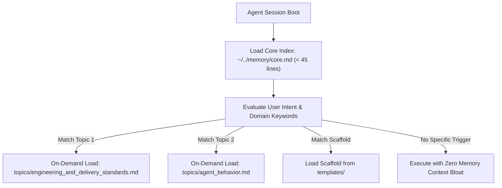

# Antigravity Persistent Memory Architecture & Production Templates

This directory provides production-grade examples and best practices for the **Antigravity Two-Tier Persistent Memory Architecture (Core Index & On-Demand Topic Loading)**.

---

## 1. What is Antigravity Two-Tier Memory?

Antigravity uses a token-efficient, high-precision two-tier memory system to maintain project intelligence across long-running pair programming sessions without bloating the active prompt context:



* **Tier 1: Core Memory Index (`core.md`)**: A lightweight router (< 45 lines) loaded at session boot. Maps domain keywords and intent triggers to specialized topic files and reference templates.
* **Tier 2: On-Demand Topic Files (`topics/*.md`)**: Deep-dive standards and behavioral SOPs loaded strictly when relevant keywords match. Adheres to Lazy Senior principles (Spec-First, Chunking, Single Source of Truth).
* **Reference Templates (`templates/*.md`)**: High-signal, actionable boilerplates and implementation laws (Spec Contract, Skill Lifecycle, Clean Code, Data Structure).

---

## 2. Foundation Memory Suite (2 Universal Pillars & 4 Templates)

### Active Topics (`topics/`)

| Topic / Document | Primary Domain | Universal Command | Core Responsibility & Boundary |
|---|---|:---:|---|
| **`engineering_and_delivery_standards.md`** | **Code & Architecture Quality** | `/plan` | **Pure Code Standards**: Upstream core refactoring, Zero-EOL runtime lifecycles, stdlib-first minimal dependencies, stateless execution, modern cryptography (AES-GCM/TLS 1.3), and zero-leakage code portability. |
| **`agent_behavior.md`** | **Agent Action & Safety Protocol** | `/plan` *(Intent Gate)* | **Agent Behavioral Guardrails**: Read-Only/Advisory mode for conceptual discussions, user confirmation for high-risk operations (`git push`, destructive actions), 7-step anti-drift brakes, and mandatory machine verification. |

### Reference Templates (`templates/`)

| Template / Contract | Purpose & Focus |
|---|---|
| **`spec_template.md`** | **4+1 Item Spec Contract**: Goal/Non-Goals firewalls, Whitelist paths, Zero-EOL deps, Deterministic verification, and SKILL.md interface purity. |
| **`vibe_skill_lifecycle.md`** | **Skill Evolution Guide**: 4-step build flow, 5 evolution traps rejection, surgical combo pipeline, and 8-point pre-delivery cheatsheet. |
| **`senior_coding_laws.md`** | **Senior Clean Code Radar**: 5-step engineering hygiene (Boundary isolation, Functional core, Flattened flow $\le 2$, Useful errors, Strict anti-whack-a-mole). |
| **`SKILL_DATA_SPEC.md`** | **Skill Data & Indexing Laws**: Pattern A flat list default vs Pattern B grouped taxonomy, thresholded in-memory inverted index ($N > 20$, $O(1)$ lookup), zero envelope tax. |

---

## 3. Directory Layout

```text
examples/memory/
├── core.md                                   # Global index & routing keywords (< 45 lines)
├── README.md                                 # Architecture overview and deployment guide
├── templates/                                # Concrete implementation scaffolds & contracts
│   ├── spec_template.md                      # 4+1 item specification contract boilerplate
│   ├── vibe_skill_lifecycle.md               # 4-step lifecycle, 5 traps, 8-point pre-delivery check
│   ├── senior_coding_laws.md                 # Clean code 5-step engineering radar
│   └── SKILL_DATA_SPEC.md                    # Pattern A flat vs Pattern B, inverted index contract
└── topics/
    ├── engineering_and_delivery_standards.md # Pure code architecture & delivery quality
    └── agent_behavior.md                     # Agent interaction boundary & machine verification
```

---

## 4. Installation & Deployment

### Step 1: Create Local Memory Directories
```bash
mkdir -p ~/../memory/topics ~/../memory/templates
```

### Step 2: Deploy Template Files
```bash
# Copy core index
cp examples/memory/core.md ~/../memory/core.md

# Copy universal topics
cp examples/memory/topics/*.md ~/../memory/topics/

# Copy reference templates
cp examples/memory/templates/*.md ~/../memory/templates/
```

### Step 3: Link Memory in Global Rules (`RULE[user_global]`)
Ensure your Antigravity global configuration or system constitution (`GEMINI.md` or config file) includes persistent memory indexing:

```markdown
Persistent Memory Management:
  - Scope: Use `~/../memory/core.md` as index; workspace data MUST remain in `<workspace>/.memory/project.md`.
  - Load/Save: Read `core.md` at conversation start. Load topic files ONLY when relevant. Save verified solutions only; never raw logs or secrets.
  - Recall & Authority: GEMINI.md dictates behavior > Current repo dictates project state > Recalled memory. Explicit user corrections override old memory.
```

---

## 5. Extension Guide: Adding Custom Domain Topics

When adding proprietary or project-specific topics (e.g., user preferences, threat intelligence feeds, CI/CD automation, cloud infrastructure):

1. **Keep Topics Focused & Concise**:
   - Each topic file should adhere to the AST threshold (< 200 lines, ideally < 60 lines).
   - Focus on specifications, mandates, and prohibitions. Avoid dumping logs, tutorials, or secrets.
2. **Register in `core.md`**:
   Add a 3-line descriptor in `core.md` with:
   - Domain category
   - File path relative to `~/../memory/`
   - Trigger keywords for semantic routing
3. **Preserve Single Source of Truth (SSOT)**:
   - Define each rule in exactly one place. If a rule governs agent action, place it in `agent_behavior.md`; if it governs code artifacts, place it in `engineering_and_delivery_standards.md`.
